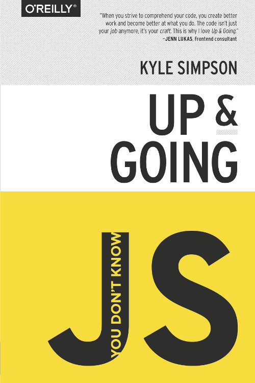

# Getting Started with JavaScript, v2

Course Link: https://frontendmasters.com/courses/web-development-v3/

JS Online Compiler: https://www.programiz.com/javascript/online-compiler/

Initial Release Date: 1 February 2023

# Books

## You Don't Know JS (book series) - 1st Edition

&nbsp;&nbsp;
&nbsp;&nbsp;
&nbsp;&nbsp;
&nbsp;&nbsp;
&nbsp;&nbsp;
&nbsp;&nbsp;

-----

## Titles

I recommend reading the **first edition** books in this order:

* [Up & Going](./books/FirstEdition/You%20Don't%20Know%20JS_Up%20%26%20Going%20-%201st%20Edition.pdf)
* [Scope & Closures](scope\%20&\%20closures/README.md#you-dont-know-js-scope--closures)
* [this & Object Prototypes](this\%20&\%20object\%20prototypes/README.md#you-dont-know-js-this--object-prototypes)
* [Types & Grammar](types\%20&\%20grammar/README.md#you-dont-know-js-types--grammar)
* [Async & Performance](async\%20&\%20performance/README.md#you-dont-know-js-async--performance)
* [ES6 & Beyond](es6\%20&\%20beyond/README.md#you-dont-know-js-es6--beyond)

-----

## You Don't Know JS Yet (book series) - 2nd Edition

&nbsp;&nbsp;
&nbsp;&nbsp;

-----

## Titles

I recommend reading the **second edition** books in this order:

* [Get Started](get-started/README.md)
* [Scope & Closures](scope-closures/README.md)
* Objects & Classes (draft stable)
* Types & Grammar (draft in progress)
* Sync & Async (not yet started)
* ES.Next & Beyond (not yet started)

-----